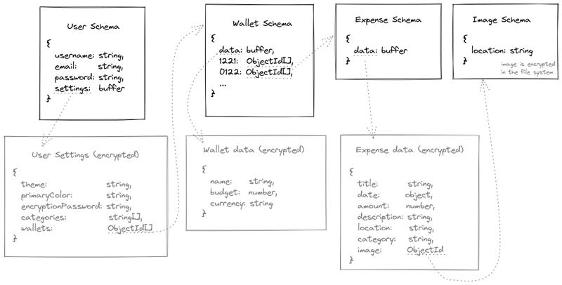

# Gadget Budget

A web application to manage your expenses securely and privately.

## Features

+ Support for multiple wallets to manage short trips, events, separate currencies, etc.
+ Support for budget alerts will help to keep unnecessary expenses under control
+ Overview important details at a glance in the dashboard
+ Dark theme, light theme, orange theme, unicorn theme...
+ Client-side encryption means your expenses are safe.

## Two-Password System

When you create an account you will be prompted for a username and a password, which is used to login the next time you visit Gadget Budget. An additional password is required in order to generate the necessary encryption keys to protect your data as you use the application, which by default is the same as your login password. This is done for your convenience but at the cost of security. You will be prompted to update your encryption password the first time you login, but it is up to you to decide whether this trade-off between convenience and security is worth it.

Please note:
- **We cannot reset your encryption password**. If you forget it you will lose access to your data.
- If you forget your *login password* we can provide a password reset **if** you also provided an email address.

## REST API endpoints

### /user

| METHOD  | ENDPOINT  | DESCRIPTION |
| ------------------------------------------ | ------- | ---------------------------------- |
|      GET  | /logout | Logs the user out of the account   |
|  POST | /signup | Used to signup new users           |
|  POST | /login  | Used to login existing user        |
|      PUT  | /update | Used to update an existing profile |

### /wallet

| METHOD  | ENDPOINT  | DESCRIPTION |
| ---------------------------------------- | ------------ | -------------------------------------------------------- |
|  GET    | /{id}        | Retrieves the specified wallet                           |
|  GET    | /s/{id}?q=12 | Retrieves expenses based on the payload query parameters |
|  POST   | /            | Creates a new wallet                                     |
|  PUT    | /{id}        | Updates the specified wallet data (not expenses)         |
|  DELETE | /{id}        | Deletes the specified wallet                             |

### /expense

| METHOD  | ENDPOINT  | DESCRIPTION |
| ---------------------------------------- | ----------------------- | -------------------------------------------------------- |
|  POST   | /{walletId}             | Creates a new expense associated to the specified wallet |
|  PUT    | /{expenseId}            | Updates the specified expense                            |
|  DELETE | /{expenseId}/{walletId} | Deletes the specified expense and reference from wallet  |

### /image

| METHOD  | ENDPOINT  | DESCRIPTION |
| ---------------------------------------- | ----- | ----------------------------- |
|  GET    | /{id} | Retrieves the specified image |
|  POST   | /{id} | Updates the specified image   |
|  DELETE | /{id} | Deletes the specified image   |

## Database Schema Design

Gadget Budget is designed to know the least amount of information as possible about your account and how you use the application. The only data that is not encrypted is the bare minimum required to get things working: your username. You can, if you want, provide an email address for password recovery purposes (note: password recovery refers to your password to gain access to your account, and not your encryption password).

In order to provide search functionality for your expenses, these are sorted by month. Other than that no other information can be retrieved from the data stored in the database, such as the precise date, the amount, the name of the wallet it was created under or any other sensitive details.

