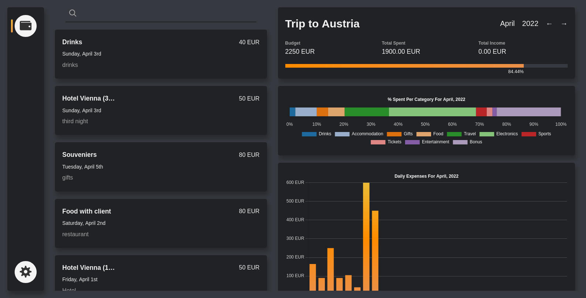

# Bit Budget

A web application to manage your expenses securely and privately.

## Feature Roadmap

+ [X] Support for multiple wallets and currencies.
+ [X] Dashboard overview.
+ [X] Client-side encryption to keep your data safe and private.
+ [ ] Synchronize past expenses when encryption password is updated.
+ [ ] Budget alerts to keep expenses under control.
+ [ ] Welcome tour to explain features after signup.
+ [ ] Theme customization
+ [ ] Sort wallets using drag and drop on the sidebar (default is by date)
+ [ ] Change sorting of displayed expenses (default is by date)

## Run Locally

You can run your own instance of Bit Budget by downloading this repository and starting the Docker Compose files from the respective client and server directories.

```
$ cd client
$ make start
```

Repeat the same step for the server directory to start the backend of the web application. By default, the client runs on localhost port 3000 and the server on port 5000. These an other configuration variables can be adjusted on their respective compose files.

To create the production builds there's another stanza for it on each directory:

```
$ make build
```

> If your OS does not have Make installed you can instead run the commands manually as described in the Makefile.